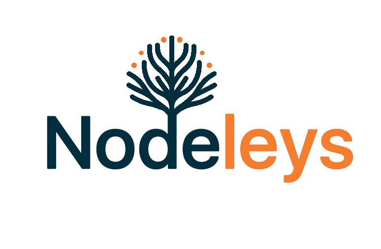
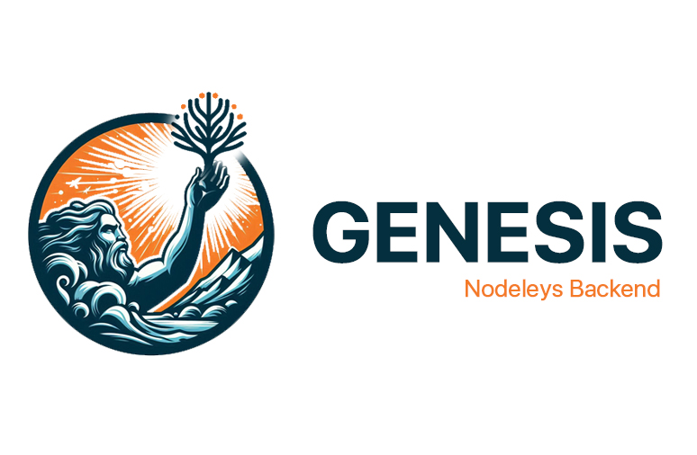

# Nodeleys (in-dev)

Nodeleys is a new lightweight deep-learning framework that works on top of CuPy (CUDA supported NumPy). Nodeleys supports automatic differentiation and dynamic computational graphs. At this milestone, Nodeleys supports CUDA with the use of CuPy. However, CuPy may be altered in the future with a better backend written directly from C/C++ CUDA. The author of this project is currently still learning how to do so.

# Genesis BackEnd

Genesis plays a crucial role as Nodeleys's backend, having a main focus on computational graphs and gradient flow algorithms which are the key features of a deep learning framework. I would like to say that Genesis is the "minimal" product of Nodeleys. With this backend as the foundation for Nodeleys, the framework currently only works on some mathematical expressions listed in the "Supported Operations" section. A layering system, initializers, multi-input or outputs, loss functions, optimizers, etc also has been developed, yet the variations is still so limited. In the future, Genesis might be replaced with a more robust and advanced backend, Exodus, supporting wider range of mathematical expressions; a wider range of customization; and rich layer, loss, and optimizer variations.

## Supported Operations
How to read: if a tensor has $`(A, B)`$, it means it is in $`\mathbb{R}^{A\times B}`$ and if a tensor has $`\emptyset`$, it is a scalar.
1. Add ($`+`$) operations
    1. $`\mathbb{R}^{A\times B} + \mathbb{R}^{A\times B}`$
    2. $`\mathbb{R}^{A\times B} + \mathbb{R}`$ and vice versa
    3. $`\mathbb{R}^{A\times B} + \mathbb{R}^{1\times B}`$ and vice versa
2. Substraction ($`-`$) operations
    1. $`\mathbb{R}^{A\times B} - \mathbb{R}^{A\times B}`$
    2. $`\mathbb{R}^{A\times B} - \mathbb{R}^{1\times B}`$ and vice versa
    3. $`\mathbb{R}^{A\times B} - \mathbb{R}^{A\times 1}`$
3. Multiplication ($`\cdot`$) operations:
    1. $`\mathbb{R}^{A\times B} \cdot \mathbb{R}^{A\times B}`$
    2. $`\mathbb{R}^{A\times B} \cdot \mathbb{R}`$ and vice versa
4. Division ($`/`$) operations:
    1. $`\mathbb{R}^{A\times B} / \mathbb{R}^{A\times B}`$
    2. $`\mathbb{R}^{A\times B} / \mathbb{R}`$ and vice versa
    3. $`\mathbb{R}^{A\times B} / \mathbb{R}^{A\times 1}`$
5. Matrix multiplication ($`@`$) operation: $`\mathbb{R}^{A\times B} @ \mathbb{R}^{B\times C}`$
6. Power (^) operations: $`(\mathbb{R}^{A\timesB})^{\mathbb{R}}`$ and vice versa
7. Reduce summation  ($`\text{redsum}`$) operation: 
    1. $`\text{redsum}(\mathbb{R}^{A\times B}, \text{axis}=0)`$
    2. $`\text{redsum}(\mathbb{R}^{A\times B}, \text{axis}=1)`$
8. 

## Features in this version
1. Node system. This version can create a node that holds a gradient, a tensor, and other states related to forward/backward propagation.
2. Forward propagation. This version supports forward propagation, although for limited operations (Supports basic operators: addition, subtraction, multiplication, and division; linear algebra operators: matrix multiplication, broadcasting (limited to the mentioned operators); and an aggregate function: reduce summation. Does not support trigonometric functions, logarithms, and other advanced functions just yet).
3. Backward propagation. Supports gradient computation for the mentioned operators.
4. Skip connections.
5. Dynamic graphs (still under development).
6. Maximum tensor rank of 2.

## What to be done
1. Dynamic graphs.
2. Support for a wider range of operations (both for forward and backward propagation).
3. Initializers.
4. Weights update mechanism.
5. Layering system.
6. Testing one input one output.